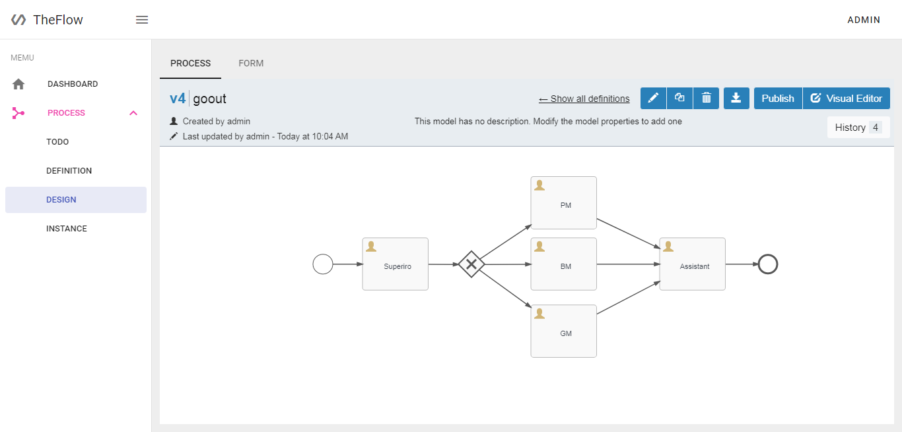
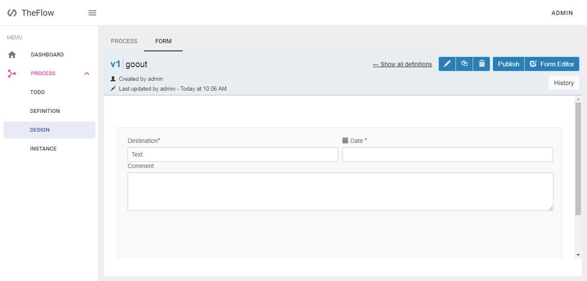
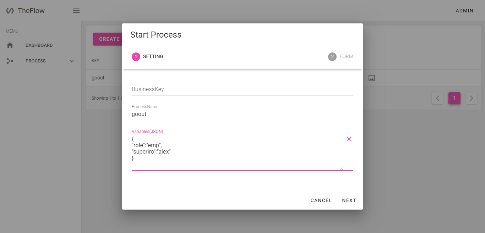
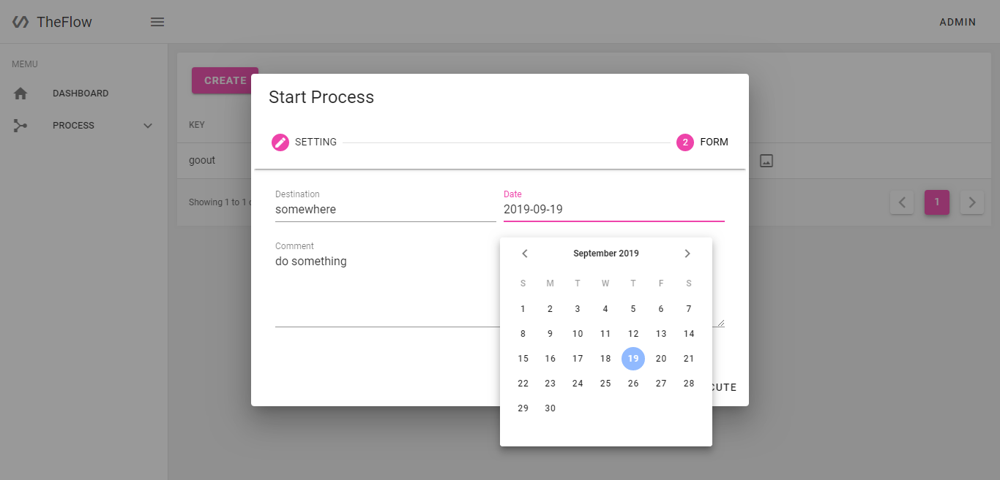
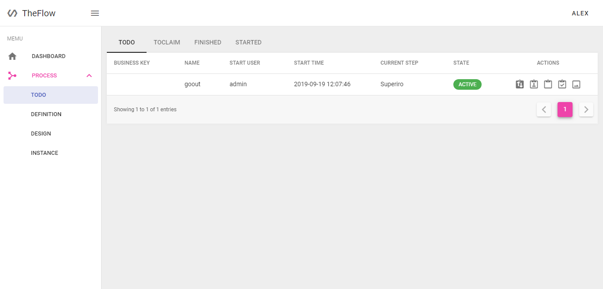
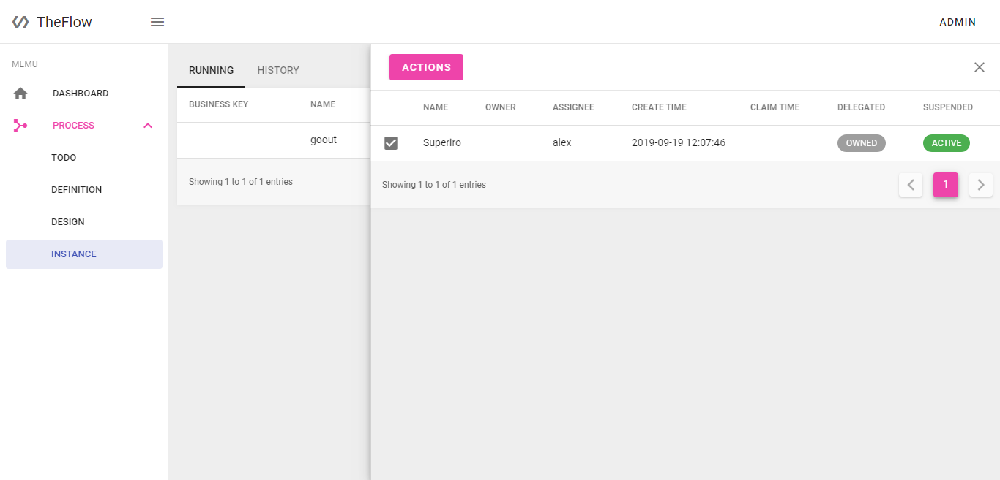

# TheFlow Console UI
### Based on vue2 and vuetify2, integrated flowable-modeler v6.4.2

## Screenshots

| -                                                                    | -                                            |
| -------------------------------------------------------------------- | -------------------------------------------- |
|  Design Process                              |  Design Form         |
|  Start Process                               |  Start With Form     |
|  Todo Page                                   |  Instance Management |

## Getting start
```bash
git clone https://github.com/firstep/theflow-console.git
cd theflow-console
npm i # or cnpm i
npm start # or npm run dev
```

## Config
> `.env - for production environment`

> `.env.dev - for devolpment environment`

> `.env.test - for test environment`

```javascript
//config backend baseurl
VUE_APP_BASEURL=http://localhost:8080
```
> Get backend source code: [https://github.com/firstep/theflow](https://github.com/firstep/theflow)

## Used in libraries
 - axios
 - vuetify-dialog
